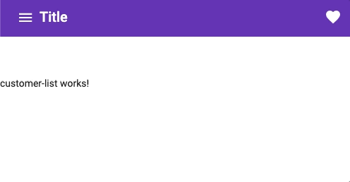

# App Bars
- Provide actions, navigation, and info for current context
- App bar always visible
- Desktop - app bar on top
- Mobile - more common to use bottom

# Contextual Action Bar
- Temporarily replaces the app bar
- Provides actions like as undo, share, or delete
- Disappears on dismissal or after time elapsed
  
  

# App Bar layout


3 dots is for the overflow menu

# Tasks
- [ ] Create 3 feature modules w/routing (orders, customers, messages)
  - [ ] `ng generate module orders --routing`
  - [ ] `ng generate module customers --routing`
  - [ ] `ng generate module messages --routing`
- [ ] Create default components
  - [ ] `ng generate component customer-list`
  - [ ] `ng generate component order-list`
  - [ ] `ng generate component message-list`
- [ ] Updating routing instructions
# app/app-routing.module.ts
```ts
import { NgModule } from '@angular/core';
import { RouterModule, Routes } from '@angular/router';

const routes: Routes = [
  {
    path: 'customers',
    // loadChildren: './customers/customers.module#CustomersModule',
    loadChildren: () => import('./customers/customers.module').then(m => m.CustomersModule)
  },
  {
    path: 'orders',
    // loadChildren: './orders/orders.module#OrdersModule',
    loadChildren: () => import('./orders/orders.module').then(m => m.OrdersModule)
  },
  {
    path: 'messages',
    // loadChildren: './messages/messages.module#MessagesModule',
    loadChildren: () => import('./messages/messages.module').then(m => m.MessagesModule)
  },
  {
    path: '',
    redirectTo:'',
    pathMatch: 'full'
  }
];
@NgModule({
  imports: [RouterModule.forRoot(routes)],
  exports: [ RouterModule]
})
export class AppRoutingModule {}
```

# app/app.module.ts
```ts
@NgModule({
  imports: [
    AppRoutingModule,
    // Material section
    Modules
  ],
})
```

# Update other routing modules to direct to the default component

## customers-routing.module.ts
```ts
import { CustomerListComponent } from './customer-list/customer-list.component';
import { NgModule } from '@angular/core';
import { RouterModule, Routes } from '@angular/router';

const routes: Routes = [
  {
    path: '',
    component: CustomerListComponent,
  },
];

@NgModule({
  imports: [RouterModule.forChild(routes)],
  exports: [RouterModule]
})
export class CustomersRoutingModule { }
```

## message-routing.module.ts
```ts
import { MessageListComponent } from './message-list/message-list.component';
import { NgModule } from '@angular/core';
import { RouterModule, Routes } from '@angular/router';

const routes: Routes = [
  {
    path: '',
    component: MessageListComponent,
  }
];

@NgModule({
  imports: [RouterModule.forChild(routes)],
  exports: [RouterModule]
})
export class MessagesRoutingModule { }
```

## orders-routing.module.ts
```ts
import { OrderListComponent } from './order-list/order-list.component';
import { NgModule } from '@angular/core';
import { RouterModule, Routes } from '@angular/router';

const routes: Routes = [{
  path: '',
  component: OrderListComponent,
}];

@NgModule({
  imports: [RouterModule.forChild(routes)],
  exports: [RouterModule]
})
export class OrdersRoutingModule { }
```

# Routing links: app.component.html
```html
<mat-drawer-container class="container" autosize>
  <mat-drawer #drawer class="sidenav" >
    <!-- navigation buttons -->
    <button color="primary" mat-button routerLink="/customers">Customers</button>
    <button color="primary" mat-button routerLink="/orders">Orders</button>
    <button color="primary" mat-button routerLink="/messages">Messages</button>
  </mat-drawer>
  <div class="sidenav-content">
      <button mat-icon-button (click)="drawer.toggle()" >
        <mat-icon>menu</mat-icon>
      </button>
      <router-outlet></router-outlet>

  </div>
</mat-drawer-container>
```

# Routing links styles: app.component.scss
```scss
.container{
  position:absolute;
  top:0;
  left:0;
  right:0;
  bottom:0;
}

.container .mat-drawer{
  min-width: 200px;
}

.container .mat-drawer .mat-button {
  display: block;
  width: 100%;
  text-align: left;
}

.spacer{
  flex: 1 1 auto;
}
```
- [ ] Install Toolbar Module
# app.module.ts
```ts
import {MatToolbarModule} from "@angular/material/toolbar";

imports: [
  MatToolbarModule,
],
```

- [ ] Wire up our UI to have a toolbar

# app.component.html
```html
<mat-drawer-container class="container" autosize>
  <mat-drawer #drawer class="sidenav">
    <!-- navigation buttons -->
    <button color="primary" mat-button routerLink="/customers">
      Customers
    </button>
    <button color="primary" mat-button routerLink="/orders">Orders</button>
    <button color="primary" mat-button routerLink="/messages">Messages</button>
  </mat-drawer>
  <div class="sidenav-content">
    <!-- adding tool bar -->
    <mat-toolbar color="primary" >
      <!-- adding title, icon and space between each other -->
      <button mat-icon-button (click)="drawer.toggle()">
        <mat-icon>menu</mat-icon>
      </button>
      <span>Title</span>
      <span class="spacer"></span>
      <mat-icon>favorite</mat-icon>
    </mat-toolbar>
    <mat-toolbar-row></mat-toolbar-row>

    <!-- where the router content is display -->
    <router-outlet></router-outlet>
  </div>
</mat-drawer-container>
```
